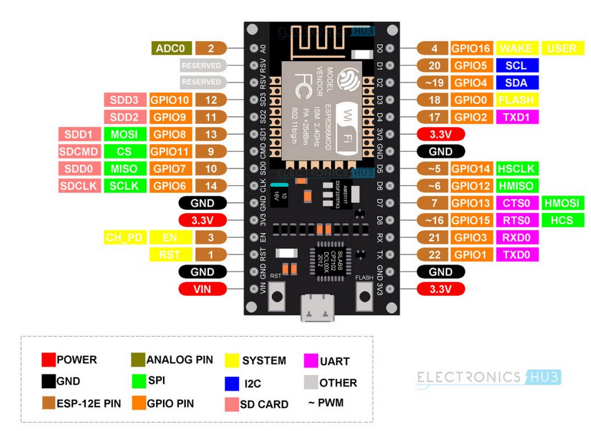
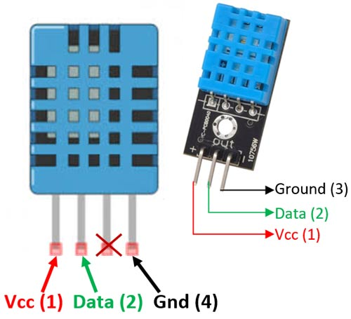
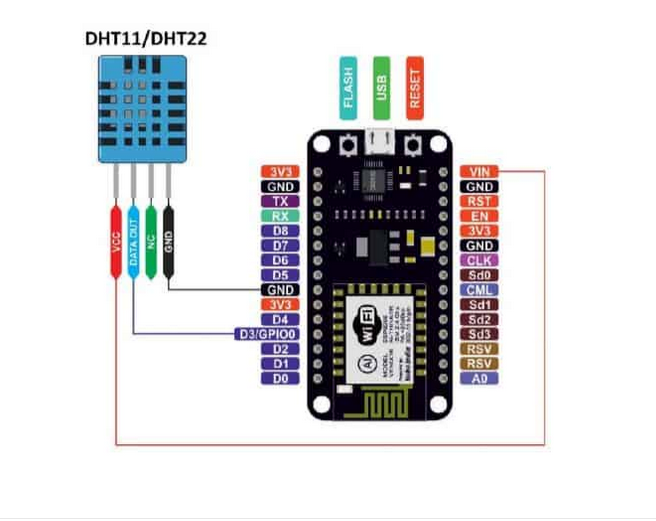
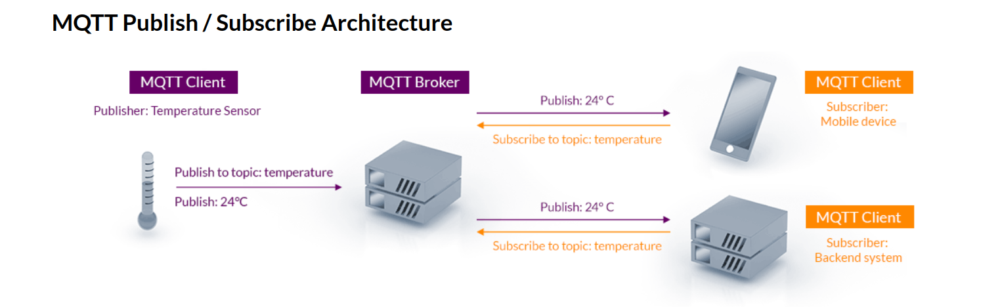

This tutorial is all about Humidity & Temperature Monitoring using DHT11 & NodeMCU on ThingSpeak. It explains how to log Humidity & Temperature data on the cloud. We can use Thingspeak as a cloud service provider and DHT11 to measure temperature and humidity.

## Hardware

| S.No | Components Name       | Quantity |
| ---- | --------------------- | -------- |
| 1    | NodeMCU ESP8266 Board | 1        |
| 2    | DHT11 Sensor          | 1        |
| 3    | Jumper Cables         | 3        |
| 4    | Breadboard            | 1        |
## Software Requirements

1. Download the [Arduino IDE](https://support.arduino.cc/hc/en-us/articles/360019833020-Download-and-install-Arduino-IDE)
2. Install Drivers for ESP8266

		'http://arduino.esp8266.com/stable/package_esp8266com_index.json'
		
	1. Copy the above path.
	2. Open your Arduino IDE.
	3. File > Preferences > Additional boards manager URLs.
	4. To add another URL code, seperate the existing URL with a comma.
	5. Tools > Board > Boards Manager.
	6. Search for esp8266 and install esp8266 by ESP8266 Community.

3. Search for the DHT Sensor library by Adafruit and Install it.

### ESP8266 Pin Out

### DHT11 Humidity and Temperature Sensor

### Circuit Diagram

### Getting Started with Thingspeak

1. Go to [Thingspeak](https://thingspeak.com/) and create an account if you do not have one. Login to your account.  
2. Create a new channel by clicking on the button. Enter the basic details of the channel. Then Scroll down and save the channel. 
	- You will need two channels, one for Humidity and one for Temperature
3. Then go to API keys copy the 'Write API Key' and paste this key to a separate notepad file. You will need it later while programming.
### MQTT Protocol

Visit this website to learn more -> https://mqtt.org/

### Coding Tasks

Task 1: Connect the ESP8266 to Wifi
Task 2: Try getting values from DHT11
Task 3: Connect to thingspeak
